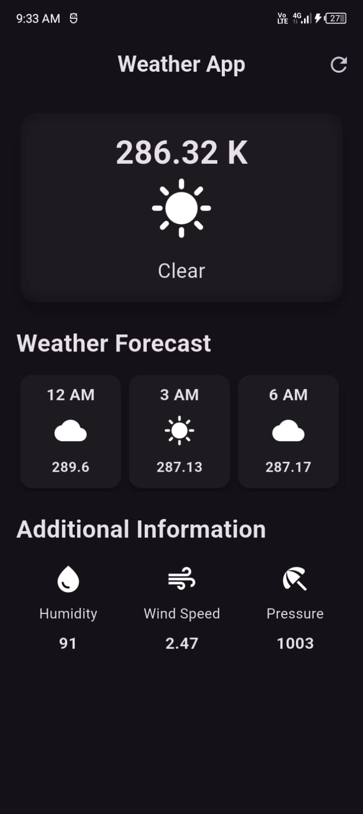

🌤 Weather App

This is a simple Weather App I built using Flutter. It shows real-time weather data like temperature, humidity, and wind speed, fetched from the OpenWeather API. I kept the design clean and minimal so it’s easy to use.

✨ Features

🚀 Splash screen with custom logo
🎨 Simple and user-friendly UI
📊 Weather details: temperature, humidity, wind speed, and condition

⚡ Real-time data using OpenWeather API

🛠 Tech Used
Flutter & Dart
OpenWeather API (for fetching weather data)
State management with plain setState

🚀 How to Run

Install Flutter
.

Get a free API key from OpenWeather
.

Clone this repository:

git clone https://github.com/TheHarshitDubey/weather-app.git
cd weather-app
flutter pub get
flutter run

## 📸 Screenshots  

### App Logo  
.jpeg)  

### Splash Screen  
.jpeg)  

### Weather Details  
  

📂 Project Structure
lib/
│── main.dart
│── screens/
│── services/
│── widgets/

📜 License

MIT License – free to use and modify.

⚡ This project helped me practice API integration in Flutter and sharpen my basics. I’ll keep improving it with more features over time.
